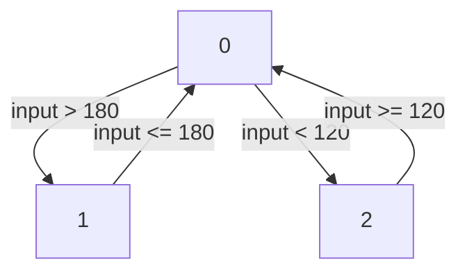

# OGMA

Ogma is a tool to facilitate the integration of safe runtime monitors into
other systems. Ogma extends
[Copilot](https://github.com/Copilot-Language/copilot), a high-level runtime
verification framework that generates hard real-time C99 code.

# Features

- Generating [NASA Core Flight System](https://cfs.gsfc.nasa.gov/) runtime
  monitoring applications that monitor data received from the message bus.

- Generating [Robot Operating System](https://ros.org) runtime monitoring
  applications.

- Generating [F' (FPrime)](https://github.com/nasa/fprime/) runtime monitoring
  components.

- Generating message handlers for NASA Core Flight System applications to make
  external data in structs available to a Copilot monitor.

- Generating monitors from diagrams in diagrammatic formats (e.g.,
  DOT/Graphviz, mermaid).

- Generating the glue code necessary to work with C structs in Copilot.

<p align="center">
  
  <br />
  <i>Integration of monitors into larger applications (e.g., simulators).</i>
</p>

<p align="center">
  
  <br />
  <i>Integration of monitors into robotics applications.</i>
</p>

## Table of Contents

- [Installation](#installation)
  - [Pre-requisites](#pre-requisites)
  - [Compilation](#compilation)
- [Usage](#usage)
  - [cFS Application Generation](#cfs-application-generation)
  - [ROS Application Generation](#ros-application-generation)
  - [F' Component Generation](#f-component-generation)
  - [Generating Monitors from Diagrams](#generating-monitors-from-diagrams)
  - [Struct Interface Generation](#struct-interface-generation)
- [Contributions](#contributions)
- [Acknowledgements](#acknowledgements)
- [License](#license)


# Installation
<sup>[(Back to top)](#table-of-contents)</sup>

## Pre-requisites
<sup>[(Back to top)](#table-of-contents)</sup>

To install Ogma from source, users must have the tools GHC and cabal-install.
At this time, we recommend GHC 8.6 and a version of cabal-install between 2.4
and 3.2. (Ogma has been tested with GHC versions up to 9.2 and cabal-install
versions up to 3.6, although the installation steps may vary slightly depending
on the version of cabal-install being used.)

On Debian or Ubuntu Linux, both can be installed with:

```sh
$ apt-get install ghc cabal-install
```

On Mac, they can be installed with:

```sh
$ brew install ghc cabal-install
```

## Compilation
<sup>[(Back to top)](#table-of-contents)</sup>

Once GHC and cabal are installed, the simplest way to install Ogma is with:
```sh
$ git clone https://github.com/nasa/ogma.git
$ cd ogma
$ export PATH="$HOME/.local/bin/:$PATH"
$ cabal update
$ cabal install --lib copilot copilot-c99 copilot-language copilot-theorem \
    copilot-libraries copilot-interpreter
$ cabal install ogma-cli:ogma
```

After that, the `ogma` executable will be placed in the directory
`$HOME/.local/bin/`, where `$HOME` represents your user's home directory.

# Usage
<sup>[(Back to top)](#table-of-contents)</sup>

The main invocation of `ogma` with `--help` lists sub-commands available. More
details are provided in the following sections.

## cFS Application Generation

[NASA Core Flight System](https://cfs.gsfc.nasa.gov/) (cFS) is a flight
software architecture to implement complex systems by combining multiple
reusable applications that communicate to one another via a software bus. cFS
has been used, among others, on spacecraft, cubesats, and drones.

Ogma includes multiple facilities to generate cFS applications. The cFS
applications generated by Ogma perform three steps to connect Copilot monitors
to the application:
- Subscribe to a message in the cFS communication bus.
- When a message of the desired kind arrives, copy the data to make it
  available to Copilot and call the monitor's main entry point.
- Declare handlers that are executed when the property being monitored is
  violated.

When using this facility, Ogma produces a Copilot file that the user is
expected to modify to implement the property to monitor. To avoid having to
modify the generated C files that implement the cFS app itself, Ogma gives the
ability to state what information one is interested in monitoring. If the kind
of information is known to Ogma, it will automatically subscribe to the
necessary messages and make it available to Copilot. Ogma provides additional
flags to customize the list of known variables, so that projects can maintain
their own variable databases beyond what Ogma includes by default.

cFS applications are generated using the Ogma command `cfs`, which receives
four main arguments:
- `--app-target-dir DIR`: location where the cFS application files must be
  stored.
- `--app-template-dir DIR`: location of the cFS application template to use.
- `--variable-file FILENAME`: a file containing a list of variables that must
be made available to the monitor.
- `--variable-db FILENAME`: a file containing a database of known variables,
and the message they are included with.
- `--handlers-file FILENAME`: a file containing a list of known fault handlers
  or triggers.
- `--template-vars FILENAME`: a JSON file containing a list of additional
  variables to expand in the template.

The following execution generates an initial cFS application for runtime
monitoring using Copilot:
```
$ ogma cfs --variable-db examples/cfs-variable-db --variable-file examples/cfs-variables --handlers-file examples/cfs-handlers
```

The application generated by Ogma contains the following files:
```
copilot-cfs-demo/CMakeLists.txt
copilot-cfs-demo/fsw/for_build/Makefile
copilot-cfs-demo/fsw/mission_inc/copilot_cfs_perfids.h
copilot-cfs-demo/fsw/platform_inc/copilot_cfs_msgids.h
copilot-cfs-demo/fsw/src/copilot_cfs.c
copilot-cfs-demo/fsw/src/Properties.hs
copilot-cfs-demo/fsw/src/copilot_cfs_msg.h
copilot-cfs-demo/fsw/src/copilot_cfs_events.h
copilot-cfs-demo/fsw/src/copilot_cfs_version.h
copilot-cfs-demo/fsw/src/copilot_cfs.h
```

Users are expected to modify `Properties.hs` to adjust the property being
monitored. In this particular example, the C code generated contains the
following instruction to subscribe to an `ICAROUS_POSITION_MID` message to
obtain the vehicle position:
```c
    CFE_SB_Subscribe(ICAROUS_POSITION_MID, COPILOT_CommandPipe);
```

The message dispatcher included in the application detects a message
of this kind and calls a dedicated subroutine:
```c
void COPILOT_ProcessCommandPacket(void)
{
    CFE_SB_MsgId_t  MsgId;

    MsgId = CFE_SB_GetMsgId(COPILOTMsgPtr);

    switch (MsgId)
    {
        case ICAROUS_POSITION_MID:
            COPILOT_ProcessIcarousPosition();
            break;
    ...
```

Finally, the dedicated subroutine makes data available to the monitor
and calls the main Copilot entry point `step`:

```c
void COPILOT_ProcessIcarousPosition(void)
{
    position_t* msg;
    msg = (position_t*) COPILOTMsgPtr;
    position = *msg;
    step();
}
```

### Template Customization

By default, Ogma uses a pre-defined template to generate the cFS monitoring
application. It's possible to customize the output by providing a directory
with a set of files with a cFS application template, which Ogma will use
instead.

To choose this feature, one must call Ogma's `cfs` command with the argument
`--app-template-dir DIR`, where `DIR` is the path to a directory containing a
cFS application template. For example, assuming that the directory
`my_template` contains a custom cFS application template, one can execute:

```
$ ogma cfs --app-template-dir my_template/ --variable-db examples/cfs-variable-db --variable-file examples/cfs-variables
```

Ogma will copy the files in that directory to the target path, filling in
several holes with specific information:

- `{{variables}}`: list of variable declarations, one for each global variable
  that holds information read from the cFS software bus that must be made
accessible to the monitoring code. For each variable, a `{{varDeclName}}` and a
`{{varDeclType}}` are defined.

- `{{msgIds}}`: list of message IDs containing information relevant for the
  application, which presumably will be passed to `CFE_SB_Subscribe`, to
subscribe to those messages in the software bus.

- `{{msgCases}}`: list of message IDs, together with the kind of information
  they contain. For each item, a `{{msgInfoId}}` and a `{{msgInfoDesc}}` are
available. This allows the cFS app to process incoming messages and delegate
the processing to an auxiliary function.

- `{{msgHandler}}`: list of messages received, together with the kind of data
  they carry, and their names. For each item, a `{{msgDataDesc}}`,
`{{msgDataVarName}}` and a `{{msgDataVarType}}` are defined.

- `{{triggers}}`: list of error handlers or fault triggers, which will be used
  by the monitoring application to notify of faults or updates from the
  monitoring system.

Additionally, the `cfs` command accepts a file with a JSON object listing
additional variables to be expanded in the template. To make use of this
feature, we encourage users to modify the template to fit their needs, and pass
the file as an argument via the flag `--template-vars`. Values passed to the
template are also respected in file names; for example, if the JSON file
contains an object key `"APP_NAME"` with the value `"Monitor"`, a file or
directory in the template named `My_{{APP_NAME}}` will be expanded in the
destination directory as `My_Monitor`.

Using this flag, you can expand two more variables in the default template:

- `{{impl_extra_header}}`: contains a list of lines to add at the top of the
  CFS application implementation, after the default includes. The value
assigned to this JSON key must be an array or list (each element will be
expanded in a separate line).

- `{{included_libraries}}`: contains a list of additional libraries that must
  be included as dependencies in the `CMakeLists.txt` file for the moniroting
application in order to be able to compile it. The value assigned this JSON key
must be an array or list of dependencies, relative to the directory of the
monitoring app).

We understand that this level of customization may be insufficient for your
application. If that is the case, feel free to reach out to our team to discuss
how we could make the template expansion system more versatile.

## ROS Application Generation

The Robot Operating System (ROS) is a framework to build robot applications.

Ogma is able to generate ROS monitoring applications that subscribe to obtain
the data needed by the monitors and report any violations. At present, support
for ROS app generation is considered preliminary.

ROS applications are generated using the Ogma command `ros`, which receives
five main arguments:
- `--app-target-dir DIR`: location where the ROS application files must be
  stored.
- `--app-template-dir DIR`: location of the ROS application template to use.
- `--variable-file FILENAME`: a file containing a list of variables that must
be made available to the monitor.
- `--variable-db FILENAME`: a file containing a database of known variables,
and the topic they are included with.
- `--handlers FILENAME`: a file containing a list of handlers used in the
  specification.

The following execution generates an initial ROS application for runtime
monitoring using Copilot:
```sh
$ ogma ros --handlers filename --variable-file variables --variable-db ros-variable-db --app-target-dir ros_demo
```

The application generated by Ogma contains the following files:
```
ros_demo/copilot/CMakeLists.txt
ros_demo/copilot/src/copilot_monitor.cpp
ros_demo/copilot/src/copilot_logger.cpp
ros_demo/copilot/src/.keep
ros_demo/copilot/package.xml
ros_demo/Dockerfile
```

The Dockerfile can be used to compile the application inside the base image for
the Space ROS distribution. To build the image, first place the core
implementation of the monitors in C inside the directory
`ros_demo/copilot/src/` (see 'Current limitations' for details). After, you can
compile the image with:
```
docker build .
```

### Format of the Variables DB File

The argument variable DB passed to the ROS backend should contain a list of
variables, together with their types and the corresponding ROS topic in which
those variables are passed. Each line in that file has the format:

```
("<NAME>","<TYPE>","<TOPIC_NAME>","<RESERVED_FOR_FUTURE_USE>")
```

For example, an input variable called "temperature" of type 64-bit signed
integer coming in a ROS topic called "/battery/temperature" should have a
matching entry in the variable DB file like the following:

```
("temperature","int64_t","/battery/temperature","ignore")
```

There should never be two lines in the same file with the same variable name.
Variables in the DB that are not not used in any of the properties being
monitored and/or are not listed in the variable file passed as argument to the
ROS command will be ignored.

For a more concrete example, see the files in `ogma-cli/examples/ros-copilot/`
and the last step of the script
`.github/workflows/repo-ghc-8.6-cabal-2.4-ros.yml`, which generates a ROS
monitor with multiple variables and compiles the resulting code.

### Template Customization

By default, Ogma uses a pre-defined template to generate the ROS monitoring
package. It's possible to customize the output by providing a directory with a
set of files with a ROS package template, which Ogma will use instead.

To choose this feature, one must call Ogma's `ros` command with the argument
`--app-template-dir DIR`, where `DIR` is the path to a directory containing a
ROS 2 package template. For example, assuming that the directory `my_template`
contains a custom ROS package template, one can execute:

```
$ ogma ros --app-template-dir my_template/ --handlers filename --variable-file variables --variable-db ros-variable-db --app-target-dir ros_demo
```

Ogma will copy the files in that directory to the target path, filling in
several holes with specific information. For the monitoring node, the variables
are:

- `{{variables}}`: list of variable declarations, one for each external data
  source needed to be read from the ROS software bus and made accessible to the
  monitoring code. For each variable declaration, the fields defined are:
  - `{{varDeclName}}`: name of the variable.
  - `{{varDeclType}}`: raw type of the variable.
  - `{{varDeclId}}`: topic name from which this variable can be obtained.
  - `{{varDeclMsgType}}`: type used to pack this variable in the software bus.

- `{{monitors}}`: list of monitors or error handlers, which will be used by the
  monitoring application to notify of faults or updates from the monitoring
  system.

We understand that this level of customization may be insufficient for your
application. If that is the case, feel free to reach out to our team to discuss
how we could make the template expansion system more versatile.

### Current limitations

The user must place the code generated by Copilot monitors in two files,
`ros_demo/src/monitor.h` and `ros_demo/src/monitor.c`. No Copilot or C code for
the monitors is generated by default.

The code generated by default assumes that handlers receive no arguments. The
user must modify the handlers accordingly if that is not the case.

Although the variable DB file is not mandatory, it is in practice required to
monitor any requirement that uses any input data: no topic subscriptions will
be generated for any variables for which a DB entry cannot be found. At present,
Ogma will proceed without warnings if a variable is mentioned in a requirement
or variables file but a matching entry is not found in the variable DB.

## F' Component Generation

F' (FPrime) is a component-based framework for spaceflight applications.

Ogma is able to generate F' monitoring components that subscribe to obtain
the data needed by the monitors and report any violations. At present, support
for F' component generation is considered preliminary.

F' components are generated using the Ogma command `fprime`, which receives
five main arguments:
- `--app-target-dir DIR`: location where the F' application files must be
  stored.
- `--app-template-dir DIR`: directory holding F' component source template.
- `--variable-file FILENAME`: a file containing a list of variables that must
be made available to the monitor.
- `--variable-db FILENAME`: a file containing a database of known variables,
and their types.
- `--handlers FILENAME`: a file containing a list of handlers used in the
  specification.

The following execution generates an initial F' component for runtime
monitoring using Copilot:
```sh
$ ogma fprime --handlers filename --variable-file filename --variable-db fprime-variable-db --app-target-dir fprime_demo
```

The component generated by Ogma contains the following files:
```
fprime_demo/CMakeLists.txt
fprime_demo/Copilot.fpp
fprime_demo/Copilot.cpp
fprime_demo/Copilot.hpp
fprime_demo/Dockerfile
fprime_demo/inline-copilot
```

### File formats

The format of the variables, variable DB, and handlers file are as follows.

The variables file can contain a list of variables used in a specification, one
per line. For example, if we are working with a specification that uses three
boolean variables called `autopilot`, `sensorLimitsExceeded`, and `pullup`, we
can provide them to Ogma's `fprime` command in a file like the following:
```sh
$ cat variables
autopilot
sensorLimitsExceeded
pullup
```

The variables database file contains a list of known variables and their types.
It does not matter if there are variables that are not used for one particular
specification, or property/requirement/monitor. The only thing that matters is
that the variables used, and their types, be listed in the file. Continuing
with the same example, we could have:

```sh
$ cat fprime-variable-db
("temperature", "uint8_t")
("autopilot", "bool")
("sensorLimitsExceeded", "bool")
("pullup", "bool")
("current_consumption", "float")
```

In our example, we only care about the boolean variables; it is sufficient that
they be listed in the variable DB file.

Finally, the handlers file is a list of monitor handlers that the generated
FPrime component should restrict to monitoring. They are listed one per line:
```sh
$ cat handlers
handlerpropREQ_001
```

### Template Customization

By default, Ogma uses a pre-defined template to generate the F' monitoring
component. It's possible to customize the output by providing a directory with
a set of files with an F' component template, which Ogma will use instead.

To choose this feature, one must call Ogma's `fprime` command with the argument
`--app-template-dir DIR`, where `DIR` is the path to a directory containing an
F' component specification template. For example, assuming that the directory
`my_template` contains a custom F' component template, one can execute:

```
$ ogma fprime --app-template-dir my_template/ --handlers filename --variable-file variables --variable-db fprime-variable-db --app-target-dir fprime_demo
```

Ogma will copy the files in that directory to the target path, filling in
several holes with specific information. For the component interface, the
variables are:

- `{{{ifaceTypePorts}}}`: Contain the type declarations for the types used by
  the ports.

- `{{{ifaceInputPorts}}}`: Contains the declarations of the `async input` port,
  to provide information needed by the monitors.

- `{{{ifaceViolationEvents}}}`: Contains the output port declarations, used to
  emit property violations.

For the monitor's header file, the variables are:

- `{{{hdrHandlers}}}`: Contains the declarations of operations to execute when
  new information is received in an input port, prior to re-evaluating the
  monitors.

For the monitor's implementation, the variables are:

- `{{{implInputs}}}`: Contains the declarations of the variables with inputs
  needed by the monitor.

- `{{{implMonitorResults}}}`: Contains the declarations of boolean variables,
  each holding the result of the evaluation of one of the monitors.

- `{{{implInputHandlers}}}`: Contains the implementations of operations to
  execute when new information is received in an input port, prior to
  re-evaluating the monitors.

- `{{{implTriggerResultReset}}}`: Contains instructions that reset the status of
  the monitors.

- `{{{implTriggerChecks}}}`: Contains instructions that check whether any
  monitor has resulted in a violation and, if so, sends an event via the
corresponding port.

- `{{{implTriggers}}}`: Contains the implementations of the functions that set
  the result of a monitor evaluation to true when the Copilot implementation
  finds a violation.

We understand that this level of customization may be insufficient for your
application. If that is the case, feel free to reach out to our team to discuss
how we could make the template expansion system more versatile.

### Current limitations

The user must place the code generated by Copilot monitors in three files,
`fprime_demo/src/copilot.h`, `fprime_demo/src/copilot_types.h` and
`fprime_demo/src/copilot.c`. No Copilot or C code for the monitors is generated
by default by the `fprime` command.

The code generated by default assumes that handlers receive no arguments. The
user must modify the handlers accordingly if that is not the case.

## Generating Monitors from Diagrams

Apart from the backends mentioned before, Ogma includes a command to
transform diagrams into monitors.

> [!NOTE]
> The interface for this command is preliminary. At present, this command
> generates a standalone monitor from a state machine diagram in either
> [mermaid](https://github.com/mermaid-js/mermaid) or
> [DOT](https://www.graphviz.org/documentation/). If you are interested in
> other formats and kinds of diagrams being supported, please open a discussion
> in the Discussions tab.
>
> Until this capability is integrated into other backends, to generate monitors
> from diagrams for cFS, ROS or F', use the `diagram` command, and then use the
> command for your target platform with the argument `--variable-file`.

There command `diagram` provides the ability to convert a diagram into a
standalone monitor. The command supports the following arguments:

- `--target-dir DIR`: Use this argument to provide a target directory for the
files generated.
- `--template-dir DIR`: Use this command to provide a custom template for the
  code being generated. See the files under `ogma-core/templates/diagram/`, as
well as other commands supporting template customization, to understand how to
customize the template.
- `--file-name FILENAME`: File with the diagram being transformed.
- `-f,--input-format FORMAT_NAME`: Name of the input format. See below for
  details.
- `-p,--prop-format FORMAT_NAME`: Format for the boolean properties or
  transition conditions in the diagram. See below for details.
- `--target-file-name FILENAME`: Filename prefix for monitoring files in target
  language (default: "monitor").
- `--mode MODE`: Mode of operation (see below for details).
- `--state-var NAME`: Name of the state variable in C (default: "state").
- `--input-var NAME`: Name of the input variable in C, if applicable (default:
  "input").

### Input Formats

At present, this command supports diagrams in
[mermaid](https://github.com/mermaid-js/mermaid) or
[DOT](https://www.graphviz.org/documentation/) (Graphviz). Below is an example
of the specific format of mermaid diagram supported:

```
graph TD;
    0-->|input > 180|1;
    1-->|input <= 180|0;
    0-->|input < 120|2;
    2-->|input >= 120|0;
```

which represents the following state machine:



Each transition in the diagram takes the shape
`Origin-->|Condition|Destination;`, where `Origin` and `Destination` are
non-negative numbers denoting states, and `Condition` is a transition condition
as described below under [Property Formats](#property-formats).

An example of the same diagram in DOT / Graphviz follows:
```
digraph g{
   rankdir="LR";
   edge[splines="curved"]
   0 -> 1 [label = "input > 180"];
   1 -> 0 [label = "input <= 180"];
   0 -> 2 [label = "input < 120"];
   2 -> 0 [label = "input >= 120"];
}
```

To specify the name of a specific format, use the argument `--input-format`
followed by one of `mermaid`, `dot`, or `graphviz` (same as `dot`).

### Property Formats

Ogma supports transition conditions specified in multiple languages, such as:

- `inputs`: The transition conditions are values of an external input variable.
  Use the additional argument `--input-var NAME` to customize the name of such
variable.

- `literal`: The expressions should be passed literally to the target file. If
  your monitoring language is Copilot, then the expressions should be boolean
Copilot streams.

- `smv`: The expressions are boolean SMV expressions.

Use the argument `--prop-format` to customize the name of the format being
used.

### Modes of Operation

The generated monitoring code can operate in one of several ways, which
can be customized via the argument `--mode`:

- `check`: Check if a system is following a state machine faithfully. It
  triggers a violation if the system transitions into a state that does
  not match the expected state.

- `calculate`: Compute the next expected state of the state machine. Under this
  mode the monitor always fires, and it provides as an argument the new state
that the state machine is in.

- `safeguard`: Check whether transitioning to a given state would be safe. Under
  this mode, the monitor always fires, and it provides as arguments booleans
indicating whether transitioning to each state would be allowed or note.  For
example, for the diagram above, the arguments passed to the external handler
would be three booleans, indicating, respectively, if transitioning to state 0
would be legal, if transitioning to state 1 would be legal, and if
transitioning to state 2 would be legal. In this mode, the machine uses the
externally provided state to determine which state it's actually in.

## Struct Interface Generation

A lot of the information that must be monitored in real-world C applications is
packed in structs. Copilot allows accessing specific fields of C structs, but
requires additional definitions in the Copilot language to make the shape of
those structs known to the compiler.

Ogma is able to generate the boilerplate code needed to work with C structs in
Copilot. For example, to use the following struct as the type of an extern
stream in Copilot, the user is expected to define several Copilot (Haskell)
types and type class instances:

```c
typedef struct {
   double x;
   double y;
} point;
```

Ogma can generate that code automatically with the `structs` subcommand:

```haskell
$ ogma structs --header-file-name examples/point.h
data Point = Point
  { pX :: Field "x" Double
  , pY :: Field "y" Double
  }

instance Struct Point where
  typename _ = "point"
  toValues v = [ Value Double (pX v), Value Double (pY v) ]

instance Typed Point where
  typeOf = Struct (Point (Field 0) (Field 0))

```

By including these definitions in a Copilot file, users can now access the
individual `x` and `y` fields of a `Point` in a stream.

# Contributions
<sup>[(Back to top)](#table-of-contents)</sup>

We'd love to receive your contributions, be it code fixes, new features, bug
reports, discussions, or anything else that can help the Ogma project.

If you have any comments, questions, ideas, or other topics that you think may
be of interest, start a new discussion
[here](https://github.com/nasa/ogma/discussions).

If you would like to contribute a fix for an issue, please comment on the issue
indicating that you want to fix it so that we can assign it to you and track
the status on our end. If the issue does not exist, create it first or ask that
an existing discussion be promoted to an issue.

If you are unsure about whether your submission should be filed as an issue or
as a discussion, file it as a discussion. We can always move it later.

To facilitate merging any pull requests that you send, please:
- Reference the issue you are addressing with the text `Refs #<ISSUENUMBER>.`
  at the end of the subject line of each commit message, in *every commit*.
  Replace `<ISSUENUMBER>` with the number of the specific issue that your pull
  request is addressing.
- Describe what each commit does individually *in the commit's message*. It's
  best to err on the side of being more descriptive than less.
- Update the CHANGELOGs in the *last commit(s)*.

You can take a look at the repository's [commit
history](https://github.com/nasa/ogma/commits/develop/) to better
understand the process we follow. Click on each commit to see how we write
commit messages.

# Acknowledgements
<sup>[(Back to top)](#table-of-contents)</sup>

Ogma has been created by Ivan Perez and Alwyn Goodloe.

The Ogma team would like to thank Swee Balachandran, Dimitra Giannakopoulou,
Anastasia Mavridou, Cesar Munoz and Thomas Pressburger, for the input during
the development of Ogma.

X-Plane images obtained via the X-Plane 10 (Pro) flight simulator. Re-shared
with permission.

# License
<sup>[(Back to top)](#table-of-contents)</sup>

Copyright 2020-2021 United States Government as represented by the
Administrator of the National Aeronautics and Space Administration. All Rights
Reserved.

See the file LICENSE.pdf for details.
