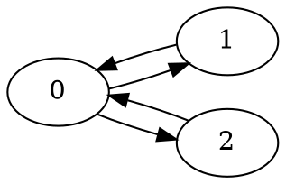
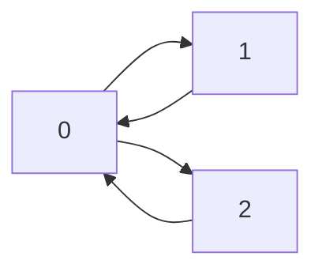
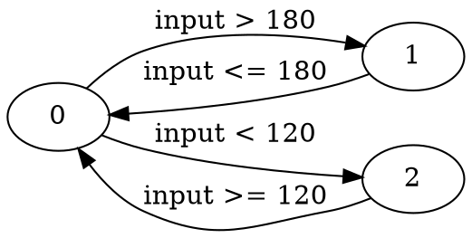
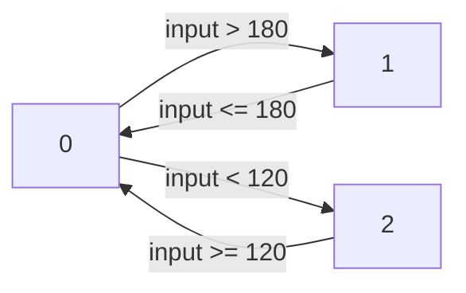
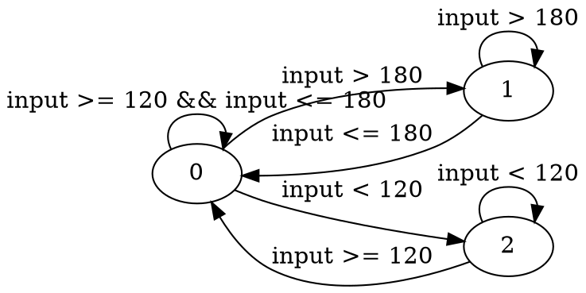

# Generating Core Flight System applications from state machines

This tutorial demonstrates how to generate applications for NASA's Core Flight
System (cFS) from state machines using Ogma. Specifically, this page shows:

- How to run Ogma and invoke the cFS backend.
- How to specify a state machines that the generated application checks.
- How to make the generated cFS application subscribe to message IDs carrying
  the state machine state that the generated application will check against,
  as well as other values used in conditions in transitions between states.
- How to build and run the generated code.

## Table of Contents

- [Introduction](#introduction)
- [Diagram and Connections](#diagram-and-connections)
  - [Diagram](#diagram)
  - [Connections](#connections)
- [Generating the cFS application](#generating-the-cfs-application)
- [Building the cFS application](#building-the-cfs-application)
- [Running the cFS application](#running-the-cfs-application)

# Introduction
<sup>[(Back to top)](#table-of-contents)</sup>

Ogma is a tool that, among other features, is capable of generating robotics
and flight applications.

NASA's [Core Flight System](https://github.com/nasa/cFS/) is a flight software
framework used on spacecraft, aircraft and robots, among others.

In the context of cFS, Ogma takes expressions describing system behavior and
generates a cFS application that implements that system, subscribing to and
publishing messages as needed.

For Ogma to be able to generate cFS applications from state machine diagrams,
users need to provide the following information:

- A state machine diagram that describes *what* state machine the system
  under observation should follow.

- An execution mode that *how* the cFS application should behave. The mode
  determines if the cFS application should publish the expected state machine's
  state or compare the predicted machine state against an externally provided
  state to find deviations from the model.

- Information that indicates *where* external data needed by the state machine
  is coming from, i.e., which messages.

An invocation of Ogma's cFS backend with a diagram may look like the following:

```sh
$ ogma cfs --target-dir demo \
           --input-file ogma-cli/examples/cfs-002-state-machines/diagram.dot \
           --input-format dot \
           --prop-format literal \
           --variable-db ogma-cli/examples/cfs-002-state-machines/db.json \
           --template-vars ogma-cli/examples/cfs-002-state-machines/extra-vars.json \
           --variable-file ogma-cli/examples/cfs-002-state-machines/vars \
           --mode check
```

where:

- `demo` is the directory where the application is produced.

- `diagram.dot` contains the state machine diagram in a graphical format
  (Graphviz).

- `dot` describes the format of `diagram.dot`.

- `literal` indicates the language used to describe transition expressions.

- `db.json` lists the data published by other cFS applications, and the types
  of messages being published.

- `extra-vars.json` contains values for other expressions that can be expanded
  in the cFS application template.

- `vars` contains a list of variables that are mentioned in the diagram and
  thus need to be available in the spec and in the cFS application.

- `check` indicates the mode of operation of this cFS application,
  specifically, that it will check if an external system is implementing the
  state machine faithfully.

File names are customizable, as are many aspects of the generated applications.
In the following, we explore how to specify the input diagram, the connections,
how to run Ogma, how to compile the resulting application, and how to check
that it works.

# Diagram and Connections
<sup>[(Back to top)](#table-of-contents)</sup>

To illustrate how Ogma works, let us define a cFS application that checks
whether the system is transitioning between states as determined by a state
machine diagram. The diagram will include the system state, as well as
conditions in the transitions.

For the sake of the example, we assume that:

- The system state is published as a `uint8_t` to the message `STATE_MID`,
  which is a label for the cFS message ID `0x1878`

- An input number is published as an `int32_t` to the message `SAMPLE_MID`,
  which is a label for the message ID `0x1879`.

The structure of those messages can be defined as the payload following the
standard cFS header:

```C
typedef struct sample_msg {
   CFE_MSG_CommandHeader_t CmdHeader;
   uint8_t                 payload;
} state_msg_t;

typedef struct sample_msg {
   CFE_MSG_CommandHeader_t CmdHeader;
   int32_t                 payload;
} sample_msg_t;
```

For simplicity, we do not publish any data associated with the notification
generated by Ogma's application, and only notify with an event when the system
transitions illegally.

## Diagram
<sup>[(Back to top)](#table-of-contents)</sup>

### States
<sup>[(Back to top)](#table-of-contents)</sup>

The first element to provide are the states that the resulting system can be
in.

In our example, that information is provided in an `diagram.dot` file that
looks like the following (this does not include expressions or constraints for
the transitions, which are described later):



Currently, Ogma uses numbers to represent states. The system is initially in
state `0`, then it may go either to `1` or `2`, from which it may come back to
state `0`. An approximate visual representation of the state machine is below.



The above diagram is specified in `dot` or Graphviz format. Ogma also accepts
diagrams specified in `mermaid`.

This diagram is incomplete; in the following subsection, we describe how to
indicate when the system should transition between states.

### Transitions
<sup>[(Back to top)](#table-of-contents)</sup>

For Ogma to generate useful code to determine if or when the system should be
in one state or another, we need to add constraints or expressions in the edges
between states. We can do so by attaching, to each edge or arrow in the
diagram, an expression that determines when the system should transition to
each state.

The following diagram adds expressions to each arrow, indicating that the state
machine should transition from the initial state `0` to state `1` when an input
variable `input` becomes greater than 180, and to state `2` when it is smaller
than 120. In either case, if the negation of that condition becomes true after
transitioning, then the system transitions back to the initial state, but it
does not transition directly between `1` and `2`.



The visual representation of the diagram is given below:



The above diagram is underspecified. Specifically, it does not state what would
happen if, for example, we are in state `0` and the input is greater than 120
but lower than 180. Implicitly, we could assume that the state machine should
not switch states, but Ogma assumes, by default, that all cases must be stated
explicitly. If there is no transition to apply in a given state, Ogma assumes
that the system is a faulty state.

A way to make the diagram more precise is to also add transitions from each
state to itself when none of the outgoing transitions apply:



The above diagram is both fully specified and fully deterministic.

## Connections
<sup>[(Back to top)](#table-of-contents)</sup>

To make the generated application subscribe to the data sources needed by the
expressions to monitor and return, Ogma also needs a file that indicates what
data other applications publish, and their type. That information can be
provided in a `db.json`, which, in our example, contains the following:

```json
{ "inputs":
     [ { "name": "state"
       , "type": "uint8_t"
       , "active": true
       , "connections":
           [ { "scope": "cfs"
             , "topic": "STATE_MID"
             , "field": "payload"
             }
           ]
       }
     , { "name": "input"
       , "type": "int32_t"
       , "active": false
       , "connections":
           [ { "scope": "cfs"
             , "topic": "SAMPLE_MID"
             , "field": "payload"
             }
           ]
       }
     ]
, "topics":
     [ { "scope": "cfs"
       , "topic": "STATE_MID"
       , "type":  "state_msg_t"
       }
     , { "scope": "cfs"
       , "topic": "SAMPLE_MID"
       , "type":  "sample_msg_t"
       }
     ]
, "types":
     [ { "fromScope": "cfs"
       , "fromType":  "state_msg_t"
       , "fromField": "payload"
       , "toScope":   "C"
       , "toType":    "uint8_t"
       }
     , { "fromScope": "cfs"
       , "fromType":  "sample_msg_t"
       , "fromField": "payload"
       , "toScope":   "C"
       , "toType":    "int32_t"
       }
     ]
}
```

This file indicates that:

- The variable `state` can be used as an input variable in an expression. Its
  basic type in C is just `uint8_t`. When targeting cFS, its values will be
  published to the topic or message ID `STATE_MID`, and the value will
  specifically be in the field `payload`. The variable is `active`, meaning
  that updates to this variable will trigger re-calculations of the monitors.

- The variable `input` can be used as an input variable in an expression. Its
  basic type in C is just `int32_t`. When targeting cFS, its values will be
  published to the topic or message ID `SAMPLE_MID`, and the value will
  specifically be in the field `payload`. This variable is not `active`,
  meaning that updates to this variable will not trigger re-calculations of the
  monitors.

- When targeting cFS, data published to the topic `STATE_MID` is a message
  of type `state_msg_t`.

- When targeting cFS, data published to the topic `SAMPLE_MID` is a message
  of type `sample_msg_t`.

- The cFS type `state_msg_t` has a field `payload` that, in `C`, has type
  `uint8_t`.

- The cFS type `sample_msg_t` has a field `payload` that, in `C`, has type
  `int32_t`.

The three sections, `inputs`, `topics` and `types`, must be consistent: if a
variable indicates that its basic type is one, the type of the data or payload
of the message received for the associated cFS topic must carry data of the
same type. Similarly, if a variable indicates that its value in cFS comes from
a field of a topic, the type associated to that topic or message ID must have a
field of that type. In our example, the three are consistent because
`sample_msg_t`, the message type for messages with ID `SAMPLE_MID`, contains a
`payload` field of type `int32_t`, and the analogous is true for the input
state.

# Generating the cFS application
<sup>[(Back to top)](#table-of-contents)</sup>

To generate the cFS application from the source files listed above, we invoke
`ogma` with the following arguments:

```sh
$ ogma cfs --target-dir demo \
           --input-file ogma-cli/examples/cfs-002-state-machines/diagram.dot \
           --input-format dot \
           --prop-format literal \
           --variable-db ogma-cli/examples/cfs-002-state-machines/db.json \
           --template-vars ogma-cli/examples/cfs-002-state-machines/extra-vars.json \
           --variable-file ogma-cli/examples/cfs-002-state-machines/vars \
           --mode check
```

Note that we pass an additional file
`ogma-cli/examples/cfs-002-state-machines/extra-vars.json`, which contains
the following:

```json
{ "impl_extra_header": "#include \"extra.h\""
, "CFS_CMD_MID":        "0x1895"
, "CFS_REEVAL_CMD_MID": "0x1896"
, "CFS_SEND_HK_MID":    "0x1897"
, "CFS_HK_TLM_MID":     "0x0897"
, "copilot_extra_defs": [ "input :: Stream Int32"
                        , "input = extern \"input\" Nothing"
                        , ""
                        , "state :: Stream Word8"
                        , "state = extern \"state\" Nothing"
                        ]
}
```

That file indicates that an extra line in the header is needed to compile the
implementation of the cFS application. The file `extra.h` contains the
following:

```C
#define STATE_MID 0x1878

typedef struct state_msg {
   CFE_MSG_CommandHeader_t CmdHeader;
   uint8_t                 payload;
} state_msg_t;

#define SAMPLE_MID 0x1879

typedef struct sample_msg {
   CFE_MSG_CommandHeader_t CmdHeader;
   int32_t                 payload;
} sample_msg_t;
```

The file `extra-vars.json` above also picks the message IDs (MIDs) used for
commands and telemetry in the generated application. We customize these MIDs to
avoid clashing with MIDs used by any applications included in the standard cFS
bundle.

The invocation above also passes a file `vars` as argument, which simply lists
inputs from the database that must be made accessible. This must be stated
explicitly because there may be many inputs in the message DB that this
application does not need to subscribe to, and, when specifying transitions in
`literal` mode, Ogma copies the properties literally and does not inspect the
properties to try to find out which variables are used in them. The contents
of that file `vars` is simply:

```
input
state
```
The call to `ogma` above creates a `demo` directory that contains several files
and directories, including:

- A dockerfile that demonstrates how to compile the application in cFS.

- A `copilot` directory, where the main generated package is defined.
  Specifically, the expressions used for triggers and outputs are specified in
  a file `copilot/fsw/src/Properties.hs`, and the cFS application that
  subscribes to data sources, runs the logic, and publishes results is
  implemented in a file `copilot/fsw/src/copilot_cfs.c`.

# Building the cFS application
<sup>[(Back to top)](#table-of-contents)</sup>

The generated application includes a
[Copilot](https://github.com/Copilot-Language/Copilot) file that contains a
formal encoding of the expressions monitored and returned.

To build the application, we must first place it within an installation of cFS.
Assuming a clean, new installation:

```sh
$ git clone --recursive -b v7.0.1 git@github.com:nasa/cfs.git
$ mv demo/copilot cfs/apps/copilot
$ cp ogma-cli/examples/cfs-001-hello-ogma/extra.h cfs/apps/copilot/fsw/src/
```

Because of how cFS applications work, we edit the file
`sample_defs/targets.cmake` and add `copilot` to the list of applications
compiled for `cpu1`. The setting of `cpu1_APPLIST` reads as follows:

```C
SET(cpu1_APPLIST ci_lab to_lab sch_lab copilot)
```

Next, we add the generated application to the list of applications that will be
executed upon starting cFS by modifying the file
`sample_defs/generate_startup.cmake` and adding the following to the end of the
list of apps that should always be present (after `sample_app`):

```csv
CFE_APP, copilot_cfs, COPILOT_AppMain, COPILOT_APP, 50, 32768, 0x0, 0;
```

To compile the application, run:
```sh
$ make native_std.prep
$ make native_std.install -j$(nproc)
```

# Running the cFS application
<sup>[(Back to top)](#table-of-contents)</sup>

We can test the generated application by feeding values for `input` using the
command-line interface tool for cFS, `cmdUtil`, and observing the output of the
cFS application.

First, compile `cmdUtil` as follows:

```sh
$ make -C tools/cFS-GroundSystem/Subsystems/cmdUtil/
```

Now, in one terminal, we launch the cFS application. Note that we need to do so
as root:

```sh
$ cd build-native_std/exe/cpu1
$ sudo ./core-cpu1
```

In another terminal, we send commands to the cFS instance. The tool `cmdUtil`
should print the binary message sent to cFS. First, we send the command to set
the input to a value that is valid at the initial state:

```sh
$ tools/cFS-GroundSystem/Subsystems/cmdUtil/cmdUtil \
    --host=localhost --port=1234 --pktid=0x1879 --endian LE -C 0 --long 150
Host: localhost
Port: 1234
Pkt ID: 0x1879
sending data to 'localhost' (IP : 127.0.0.1); port 1234
Data to send:
0x18 0x79 0xC0 0x00 0x00 0x05 0x00 0x00
0x96 0x00 0x00 0x00
```

This publishes the value `150` once as the payload of the command with ID
`0x1879` or `SAMPLE_MID`, associated with the variable `input`.

We then re-affirm that the state machine is in the initial state, by sending a
message to update `state`, associated with the message ID `0x1878` or
`STATE_MID`:

```sh
$ tools/cFS-GroundSystem/Subsystems/cmdUtil/cmdUtil \
    --host=localhost --port=1234 --pktid=0x1878 --endian LE -C 0 -b 0
Host: localhost
Port: 1234
Pkt ID: 0x1878
sending data to 'localhost' (IP : 127.0.0.1); port 1234
Data to send:
0x18 0x78 0xC0 0x00 0x00 0x02 0x00 0x00
0x00
```

Sending this message causes the generated `copilot` app to re-evaluate whether
the system is following the state machine faithfully. In this case, because it
is valid for the machine to be in state 0 when the input is 150, there is no
violation, so no event is printed by the `copilot` app.

Let us now transition states. First, we update the input, which would cause a
transition to state 2:

```sh
$ tools/cFS-GroundSystem/Subsystems/cmdUtil/cmdUtil \
    --host=localhost --port=1234 --pktid=0x1879 --endian LE -C 0 --long 80
Host: localhost
Port: 1234
Pkt ID: 0x1879
sending data to 'localhost' (IP : 127.0.0.1); port 1234
Data to send:
0x18 0x79 0xC0 0x00 0x00 0x05 0x00 0x00
0x50 0x00 0x00 0x00
```

Once again, this does not cause a re-evaluation of compliance with the state
machine yet because the input variable `input` is not active, so it's value is
merely stored.

We now update the state to the correct state after this change of `input`.
Because `state` is an active input variable, the application now re-evaluates
whether the state machine is being followed faithfully:

```sh
$ tools/cFS-GroundSystem/Subsystems/cmdUtil/cmdUtil \
    --host=localhost --port=1234 --pktid=0x1878 --endian LE -C 0 -b 2
Host: localhost
Port: 1234
Pkt ID: 0x1878
sending data to 'localhost' (IP : 127.0.0.1); port 1234
Data to send:
0x18 0x78 0xC0 0x00 0x00 0x02 0x00 0x00
0x02
```

Because this transition is valid according to the state machine diagram, the
`copilot` cFS app does not trigger any notification.

To confirm that the application can detect violations, let us now transition
incorrectly. Retaining the same value for the input, which should keep
the state machine in state 2, let us send a command to indicate that it has
instead transitioned to state 1:

```sh
$ tools/cFS-GroundSystem/Subsystems/cmdUtil/cmdUtil \
    --host=localhost --port=1234 --pktid=0x1878 --endian LE -C 0 -b 1
Host: localhost
Port: 1234
Pkt ID: 0x1878
sending data to 'localhost' (IP : 127.0.0.1); port 1234
Data to send:
0x18 0x78 0xC0 0x00 0x00 0x02 0x00 0x00
0x01
```

The reception of this message triggers a notification to be published. The
output message indicates that the application detected a violation of the
state machine diagram:

```
1980-012-14:03:20.25484 ES Startup: Loading file: /cf/copilot_cfs.so, APP: COPILOT_APP
1980-012-14:03:20.25494 ES Startup: COPILOT_APP loaded and created
EVS Port1 42/1/COPILOT_APP 1: COPILOT App Initialized. Version 1.0.0.0
1980-012-14:03:20.30498 ES Startup: CFE_ES_Main entering APPS_INIT state
1980-012-14:03:20.30500 ES Startup: CFE_ES_Main entering OPERATIONAL state
EVS Port1 42/1/CFE_TIME 21: Stop FLYWHEEL
EVS Port1 42/1/COPILOT_APP 3: COPILOT: violation: handler
```

This example uses `cmdUtil` to provide input commands merely for demonstration
purposes. Presumably, values would be published by other cFS applications, and
the results produced by the cFS application generated by Ogma would be consumed
by other applications.

Note also that, in this example, `SAMPLE_MID` and `STATE_MID` are commands, but
the same technique can be used to detect and read information from telemetry
messages.
