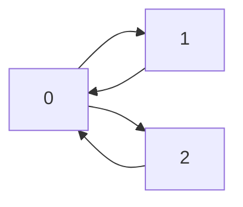
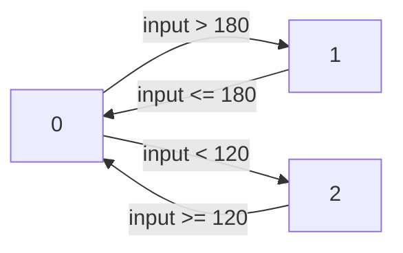
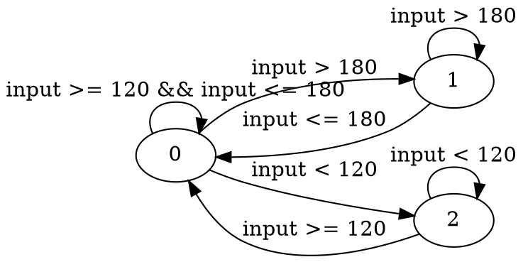

# Generating applications from state machine diagrams

This tutorial demonstrates how to generate applications from state machine
diagrams using Ogma. Specifically, this page shows:

- How to run Ogma and invoke the diagram backend.
- How to specify the state machine diagrams that the generated application
  implements.
- How to build and run the generated code.

## Table of Contents

- [Introduction](#introduction)
- [Diagrams](#diagrams)
  - [States](#states)
  - [Transitions](#transitions)
- [Generating the application](#generating-the-application)
- [Building the application](#building-the-application)
- [Running the application](#running-the-application)

# Introduction
<sup>[(Back to top)](#table-of-contents)</sup>

Ogma is a tool that, among other features, is capable of generating robotics
and flight applications.

State machines are commonly used to capture the behavior of robots, aircraft
and spacecraft in operation, which transition between different states or modes
that dictate their behavior. For example, a robot may be stopped, being
controlled by a human operator, navigating automatically, etc. A drone may be
stopped, taking off, landing, being piloted by a human operator, automatically
holding its position, navigating automatically using GPS, and so on.

In such systems, it is useful to be able to determine if the system is
transitioning between these states correctly (e.g., it never goes from flying
to stopped without landing first), whether an intended state change should be
allowed (e.g., it never attempts to go into automatic navigation without a GPS
fix), or just to have an implementation of the expected transition logic that
follows the state machine specification faithfully.

Ogma can take a state machine diagram and generate a C program that implements
any of the aforementioned use cases. For Ogma to be able to generate state
machine implementations, users need to provide the following information:

- A state machine diagram that describes valid states and transitions, in one
  of the supported formats.

- An indication of the mode that the resulting code should operate in (e.g.,
  checking the current state against an expectation, calculating the next
  state).

An invocation of Ogma's diagram backend may look like the following:

```sh
$ ogma diagram --app-target-dir demo \
               --mode calculate \
               --file-name ogma-cli/examples/diagram-001-hello-ogma/diagram-copilot.dot \
               --file-format dot \
               --prop-format literal
```

where:

- `demo` is the directory where the application is produced.

- `calculate` is the mode of operation of the generated code.

- `diagram-copilot.dot` contains the state machine diagram that needs to be implemented.

- `dot` describes the format of `diagram-copilot.dot`.

- `literal` indicates the language used to describe the expressions in the transitions between states.

File names are customizable, as are many aspects of the generated applications.
In the following, we explore how to specify the diagrams, including the states
and transitions, how to run Ogma, how to compile the resulting application, and
how to check that it works.

# Diagrams
<sup>[(Back to top)](#table-of-contents)</sup>

To illustrate how Ogma works, let us implement a state machine that transitions
between three states depending on the value of an input variable.

## States
<sup>[(Back to top)](#table-of-contents)</sup>

The first element to provide are the states that the resulting system can be in.

In our example, that information is provided in an `diagram-copilot.dot` file,
which, in our case, looks like the following (this does not include expressions
or constraints for the transitions, which will described later):

```
digraph g{
   rankdir="LR";
   edge[splines="curved"]
   0 -> 1;
   1 -> 0;
   0 -> 2;
   2 -> 0;
}
```

Currently, Ogma uses numbers to represent states. The system is initially in
state `0`, then it may go either to `1` or `2`, from which it may come back to
state `0`. An approximate visual representation of the state machine is below.



The above diagram is specified in `dot` or Graphviz format. Ogma also accepts
diagrams specified in `mermaid`.

This diagram is incomplete; in the following subsection, we describe how to
indicate when the system should transition between states.

## Transitions
<sup>[(Back to top)](#table-of-contents)</sup>

For Ogma to generate useful code to determine if or when the system should be
in one state or another, we need to add constraints or expressions in the edges
between states. We can do so by attaching, to each edge or arrow in the
diagram, an expression that determines when the system should transition to
each state.

The following diagram adds expressions to each arrow, indicating that the state
machine should transition from the initial state `0` to state `1` when an input
variable `input` becomes greater than 180, and to state `2` when it smaller
than 120. In either case, if the negation of that condition becomes true after
transitioning, then the system transitions back to the initial state, but it
does not transition directly between `1` and `2`.

```
digraph g{
   rankdir="LR";
   edge[splines="curved"]
   0 -> 1 [label = "input > 180"];
   1 -> 0 [label = "input <= 180"];
   0 -> 2 [label = "input < 120"];
   2 -> 0 [label = "input >= 120"];
}
```

The visual representation of the diagram is given below:



The above diagram is underspecified. Specifically, it does not state what would
happen if, for example, we are in state `0` and the input is greater than 120
but lower than 180. Implicitly, we could assume that the state machine should
not switch states, but Ogma assumes, by default, that all cases must be stated
explicitly. If there is no transition to apply in a given state, Ogma assumes
that the system is a faulty state.

A way to make the diagram more precise is to add also transitions from each
state to itself when none of the outgoing transitions apply:



The above diagram is both fully specified and fully deterministic.

# Generating the application
<sup>[(Back to top)](#table-of-contents)</sup>

To generate the application from the diagram above, we invoke `ogma` with the
following arguments:

```
$ ogma diagram --app-target-dir demo \
               --prop-format literal \
               --mode calculate \
               --file-format dot \
               --file-name ogma-cli/examples/diagram-001-hello-ogma/diagram-copilot.dot
```

We specify the mode of operation `calculate`, which instructs Ogma to generate
code that will implement the state machine. Other modes available are `check`,
in which the code generated checks it the current state matches an expectation,
and `safeguard`, in which the code reports the states that the system is
allowed to transition to based on its current state and inputs.

The call to `ogma` above creates a `demo` directory that contains a
specification of the state machine in the diagram.

# Building the application
<sup>[(Back to top)](#table-of-contents)</sup>

The generated application includes a
[Copilot](https://github.com/Copilot-Language/Copilot) file that contains a
formal encoding of a monitor for the state machine under
`demo/copilot/Copilot.hs`.

To build the application, we must first go tho the directory where the
specification is located, and compile it to C99 code:

```sh
$ cd demo/Copilot/
$ runhaskell Copilot.hs
```

The above command generates three files in the same directory: `monitor.c`,
`monitor.h`, and `monitor_types.h`. The first contains the implementation of
the state machine, the second contains the interface to the state machine, and
the last one would normally contain any auxiliary type definitions, and is
empty in this case.

We can compile that C code with a standard C compiler as follows:

```sh
$ gcc -c monitor.c
```

The code generated expects that state machine starts at the initial state `0`,
that the current system input will be made available in a global variable
called `input`, and that an existing function `handler` will exist and be able
to handle notifications from the generated code with the new state. In `check`
mode, the generated code also expects a variable `state` that will hold the
system state, which the generated monitor compares against the internally
calculated or expected state. The names `input` and `state` can be customized
by the user via a combination of command-line flags and transition expressions.
Run `ogma diagram --help` for more information.

# Running the application
<sup>[(Back to top)](#table-of-contents)</sup>

The code generated by Ogma does not contain a `main` entry point for the
program. To test the generated module, we write a C program in a file `main.c`
defines different values for `input`, calls the state machine implementation to
calculate the new expected state, and reports the results:

```
#include <stdio.h>
#include <stdint.h>
#include <stdlib.h>

#include "monitor.h"

uint8_t  input     = 150;
uint8_t  state     = 0;
uint64_t iteration = 0;

/**
 * Function called by the state machine to communicate its expected state.
 *
 * @param handler_arg0 The new state of the state machine.
 * @param handler_arg1 The previous state of the state machine.
 * @param handler_arg2 The input received that caused the transition.
 */
void handler(uint8_t handler_arg0, uint8_t handler_arg1, uint8_t handler_arg2)
{
  printf("[Calculated] Previous state: %d, input: %d, new state: %d\n",
         handler_arg1, handler_arg2, handler_arg0);

  iteration++;

  state = handler_arg0;
}

/**
 * Report the current, internally calculated input and state, and call the
 * state machine to calculate the new state. The function <code>step</code>
 * calls <code>handler</code> at each step.
 */
void next()
{
  printf("Executing step %ld: input %d, state %d\n", iteration, input, state);
  step();
  printf("--------------------------------------\n");
}

void main (int argc, char **argv)
{
  // We step with initial state 0 and input 150. The machine should remain in
  // state 0.
  next();

  // We step again with input greater than 180. The machine should now
  // transition to state 1.
  input = 185;
  next();

  // We step again with no changes. The machine should remain in state 1.
  next();

  // We step again with input lower than or equal to 180. The machine should
  // now transition to state 0.
  input = 110;
  next();

  // We step again with no changes. The machine should transition to state 2.
  next();

  // We step again with no changes. The machine should remain in state 2.
  next();

  // We step again with an input greater than 180. The machine should now
  // transition to state 0.
  input = 185;
  next();
}
```

We can compile and link all C files together as follows:
```
$ gcc main.c monitor.c -o main
```

If we launch the program, we can see how the state machine switches between
states. At each step, the program first reports the state it is in and its
current input, and then the generated code calls `handler`, which reports the
state the machine was in, the input received, and the new state:

```
Executing step 0: input 150, state 0
[Calculated] Previous state: 0, input: 150, new state: 0
--------------------------------------
Executing step 1: input 185, state 0
[Calculated] Previous state: 0, input: 185, new state: 1
--------------------------------------
Executing step 2: input 185, state 1
[Calculated] Previous state: 1, input: 185, new state: 1
--------------------------------------
Executing step 3: input 110, state 1
[Calculated] Previous state: 1, input: 110, new state: 0
--------------------------------------
Executing step 4: input 110, state 0
[Calculated] Previous state: 0, input: 110, new state: 2
--------------------------------------
Executing step 5: input 110, state 2
[Calculated] Previous state: 2, input: 110, new state: 2
--------------------------------------
Executing step 6: input 185, state 2
[Calculated] Previous state: 2, input: 185, new state: 0
--------------------------------------
```

The generated implementation for the state machine transitions between the
different states as specified in the diagram above. With trivial changes, we
can make the state machine compare its internally calculated state against the
value of `state`, and only call handler if the two are different.
Alternatively, we can also make the machine call `handler` at every step,
indicating if transitioning to the different states is allowed from the current
state and with the current `input`, for which we have to modify the signature
of `handler` to accept a boolean parameter for each of the machine states.
